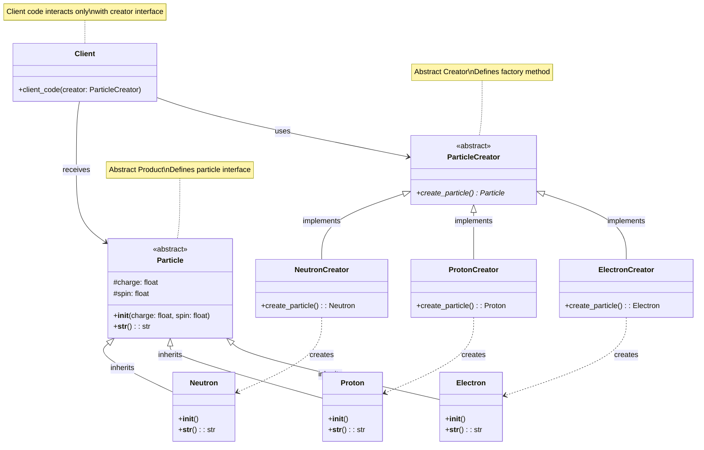
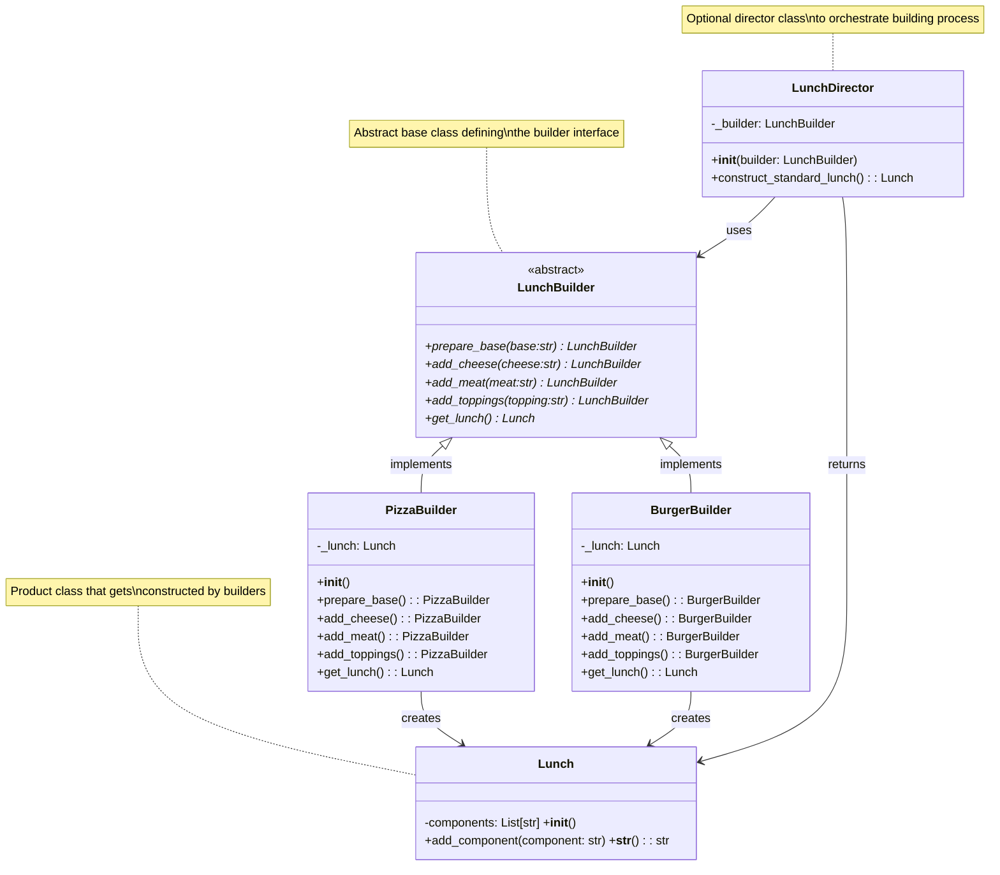

# Factory Pattern Particle Factory Example:

```mermaid

classDiagram
    class Particle {
        <<abstract>>
        #charge: float
        #spin: float
        +__init__(charge: float, spin: float)
        +__str__(): str
    }

    class Electron {
        +__init__()
        +__str__(): str
    }

    class Proton {
        +__init__()
        +__str__(): str
    }

    class Neutron {
        +__init__()
        +__str__(): str
    }

    class ParticleCreator {
        <<abstract>>
        +create_particle()* Particle
    }

    class ElectronCreator {
        +create_particle(): Electron
    }

    class ProtonCreator {
        +create_particle(): Proton
    }

    class NeutronCreator {
        +create_particle(): Neutron
    }

    class Client {
        +client_code(creator: ParticleCreator)
    }

    %% Inheritance relationships
    Particle <|-- Electron : inherits
    Particle <|-- Proton : inherits
    Particle <|-- Neutron : inherits

    ParticleCreator <|-- ElectronCreator : implements
    ParticleCreator <|-- ProtonCreator : implements
    ParticleCreator <|-- NeutronCreator : implements

    %% Creation relationships
    ElectronCreator ..> Electron : creates
    ProtonCreator ..> Proton : creates
    NeutronCreator ..> Neutron : creates

    %% Client usage
    Client --> ParticleCreator : uses
    Client --> Particle : receives

    %% Notes
    note for Particle "Abstract Product\nDefines particle interface"
    note for ParticleCreator "Abstract Creator\nDefines factory method"
    note for Client "Client code interacts only\nwith creator interface"
```

---

# Builder Pattern Lunch Example:

```mermaid
classDiagram
class Lunch {
-components: List[str] +**init**()
+add_component(component: str) +**str**(): str
}

    class LunchBuilder {
        <<abstract>>
        +prepare_base(base:str)* LunchBuilder
        +add_cheese(cheese:str)* LunchBuilder
        +add_meat(meat:str)* LunchBuilder
        +add_toppings(topping:str)* LunchBuilder
        +get_lunch()* Lunch
    }

    class PizzaBuilder {
        -_lunch: Lunch
        +__init__()
        +prepare_base(): PizzaBuilder
        +add_cheese(): PizzaBuilder
        +add_meat(): PizzaBuilder
        +add_toppings(): PizzaBuilder
        +get_lunch(): Lunch
    }

    class BurgerBuilder {
        -_lunch: Lunch
        +__init__()
        +prepare_base(): BurgerBuilder
        +add_cheese(): BurgerBuilder
        +add_meat(): BurgerBuilder
        +add_toppings(): BurgerBuilder
        +get_lunch(): Lunch
    }

    class LunchDirector {
        -_builder: LunchBuilder
        +__init__(builder: LunchBuilder)
        +construct_standard_lunch(): Lunch
    }

    %% Relationships
    LunchBuilder <|-- PizzaBuilder : implements
    LunchBuilder <|-- BurgerBuilder : implements
    LunchDirector --> LunchBuilder : uses
    PizzaBuilder --> Lunch : creates
    BurgerBuilder --> Lunch : creates
    LunchDirector --> Lunch : returns

    %% Notes
    note for LunchBuilder "Abstract base class defining\nthe builder interface"
    note for LunchDirector "Optional director class\nto orchestrate building process"
    note for Lunch "Product class that gets\nconstructed by builders"
```
